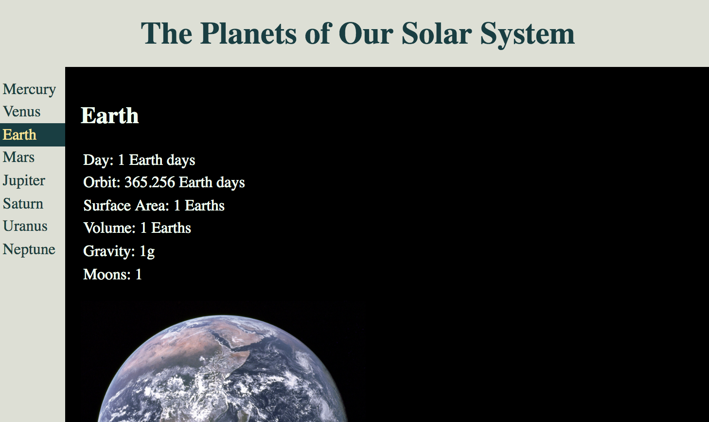

# Pub/Sub Planets Lab

**Lab Duration: 180 minutes**

### Learning Objectives

- Understand how to pass data between models and views using Pub/Sub
- Be able to use the Pub/Sub pattern to build a modular front-end app

## Brief

Using the provided start code, your task is to create an app that allows a user to click on a planet name in the menu (already provided), to view the planet's details. Implement the Pub/Sub pattern to separate your presentation and business logic into views and models.

*Screenshot of final planets application*

### MVP

- Allow the user to click a planet name in the menu to view the details of the planet.

### Extensions

- Style the application with CSS. You can use [classList](https://developer.mozilla.org/en-US/docs/Web/API/Element/classList) to add css class names to your elements that are created in the JavaScript to be able to select them in your CSS.
- You might want to try styling the page with [CSS Grid](https://css-tricks.com/snippets/css/complete-guide-grid/)

## Considerations

What are the responsibilities of the views and models? What is responsible for listening for the click of the menu item? What is responsible for finding the selected planet object? What is responsible for deciding how the planet details should be rendered?

## Planning

Draw a diagram of your files, detailing the publishing of and subscribing to events and the flow of data through the application.

One approach you could take would be:
1. Create a view that is responsible for handling the click on the menu that:
  - has access to the DOM's menu items.
  - adds an event listener to each menu item's click event that. publishes the menu item's ID out to the application.
2. In the model:
  - listen for the ID of the clicked menu item being published.
  - use the ID to find the corresponding menu item from the data collection.
  - publish the selected planet object out to the application.
3. Create a view that is responsible for rendering the selected planet's details to the page that:
  - listens for the selected planet being published by the model.
  - creates html elements that are populated with the planet details.
  - appends the newly populated elements to a DOM element.
