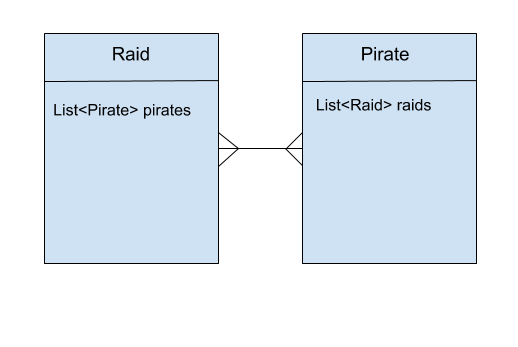
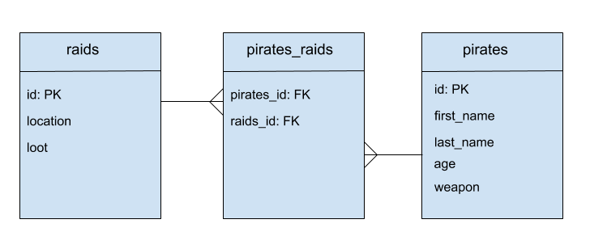

# Many-To-Many Relationships using Annotations

## # Learning Objectives

- Understand the many-to-many relationship.
- Know how to map many-to-many relationships using hibernate annotations.

## Introduction

**Why are we learning this?**
When saving objects to the database, we want to save them in such a way that when the data is queried, the relationships are preserved. Or that the relationships between objects actually help us query the data.

For example:

- Given a student "Jim", give me the classroom he's part of that has white walls
- Given classroom, give me all the students which use it that have brown hair

Without the many to many relationships, these queries of structured data wouldn't be possible. We need to allow relationships to be saved to the database. As mentioned before, there are three types.

This lesson will focus on Many-to-Many.

## Understanding the relationships

Extending our pirate system even further, we now want to add a `Raid` class that will be persisted with a `raids` table. This model should have properties:

* location - the name of a location where the raid takes place. Eg: Glasgow, Edinburgh, Tortuga, Tresure Island
* loot - the amount of plunder that was looted in that raid

A pirate can go on many different raids, and raids can have many different pirates go on them. A raid is simply a location that a group of pirates will visit together to "collect plunder" by whichever means they please.
Without the database mappings, this is just a case of having a `List` of `Pirate` in `Raid` and a `List` of `Raid` in `Pirate`. To save that relationship in the database we need to do a little more.

This requires the **many-to-many** relationship. A pirate can go on many raids, and a raid can have many pirates:



*Many to Many Relationship*

We need to understand that with many-to-many, the relationship is relatively symmetrical. It's also important to know that each side still has to be mapped for JPA + Hibernate to setup the relationship correctly.

### Why do both sides need to be mapped?

With JPA + Hibernate which we are going to use, both sides of the relationship need to be mapped because we want to be able to make queries from both sides. For example if we have a `Raid` object and want to know which `Pirate`s went on that raid, then the mapping must exist from the `Raid` side. The same applies for the opposite. For example if we have a `Pirate` and want to know which `Raid`'s that pirate went on, we need to have the mapping on that side.

## Database Tables

Taking about the database side and putting the Java to one side for a moment. We know two tables are required. One called `pirates` and one `raids`.

### Foreign Keys in a Join Table

Many-to-many relationships between two tables in databases are made by creating a join table that sits between the two tables. The join table has two columns for foreign keys. One with the foreign key of one side (our `pirates` foreign key) and the other with foreign key of the other side of our relationship (the `raids` foreign key). The columns are simply named `pirate_id` and `raid_id`, respectively.

Each row of the join table maps one side of the relationship to the other and each mapping can exist many times for either side. An example of populated tables including join table for our `pirates` + `raids` might look like this:

**raids**

| id | location | loot |
|----|----------|------|
|  1 | Tortuga  |  100 |
|  2 | Tortuga  |  100 |
|  3 | Tortuga  |  100 |
|  4 | Tortuga  |  100 |

**pirates_raids** (join table)

| Pirate ID | Raid ID |
| --------- | ------- |
| 1         | 3       |
| 1         | 4       |
| 1         | 2       |
| 2         | 1       |

**pirates**

 id | age | first_name | last_name | ship_id
----|-----|------------|-----------|---------
  1 |  32 | jack       | sparrow   |       1
  2 |  40 | jimmy      | nail      |       2

- Pirate with id `1` has raids `3`, `4` and `2`
- Pirate with id  `2` has raid `1`
- Raid with id `3` has pirate `1`

Our table diagram now looks like this.



*Database table diagram with relationships*

## Setting up the Relationships for JPA + Hibernate

We now understand the relationship we want to create in Java code and have some understand of what the resulting table structure needs to be. A quick summary so far will help with the next steps:

- Pirate should have many raids
  - `Pirate` should contain a list of `Raid`
  - `Pirate` should have something that sets up one side of the join table `pirates_raids`
- Raid should have many pirates
   - `Raid` should contain a list of `Pirate`
   - `Raid` should have something that sets up the other side of the join table `pirates_raids`

**Remember** when adding lists they need to be instansiated in the constructor.

## Annotations

By using the above steps as a guide, we now have enough information to correctly annotate `Raid` and `Pirate` classes.

### Many `Pirate`s should have many `Raid`s

An annotation for this is provided by JPA `@ManyToMany`. It should be used to annotate properties of a class or the properties getters. Typically these properties are of type `Collection`, `List` or `ArrayList`.

### JoinTable and JoinColumn

`@JoinTable` is required to setup the join table. We must instruct JPA about the join table we wish to have created for us, as well as which columns to setup within that join table. To indicate which columns we want in the join table, a `@JoinColumn` must be passed into the `@JoinTable` via the `joinColumn` argument. We must give that the name of the columns we wish to setup in the join table **from the point of view of the class or table we are "in"**.

So in `Pirate` we will give the `JoinTable` a `JoinColumn` with name `pirate_id`.

```java
#Pirate Class

@ManyToMany
@JoinTable(
  name = "pirates_raids",
  joinColumns = { @JoinColumn(
    name = "pirate_id",
    nullable = false,
    updatable = false)
  }
)

private List<Raid> raids;
```

We must also map the reverse with the `inverseJoinColumns` argument to `@JoinTable`. Remember this is from the point of view of the class we are "in", so for `Pirate` this would be `raid_id`.

```java
#PirateClass

@JsonIgnore
@ManyToMany
@JoinTable(
  name = "pirates_raids",
  joinColumns = { @JoinColumn(
    name = "pirate_id",
    nullable = false,
    updatable = false)
  },
  inverseJoinColumns = { @JoinColumn(
    name = "raid_id",
    nullable = false,
    updatable = false)
  }
)

private List<Raid> raids;
```

We don't want these columns in the join table to be allowed to be set to null. Also, it's not desired that they should be able to be individually updated. This is because allowing the join tables rows to be set individually will break relationships that exist. This is not to say the relationships should never be removed, it just means they cannot be individually changed once created.

### Many `Raid`s should have many `Pirate`s

For the other side of this relationship, we use exactly the same annotations with the same rules:

- `@ManyToMany`
- `@JoinTable` with
	- name of join table
	-  `joinColumns` containing a `@JoinColumn` with the name of the column we wish to map the foreign key for from that class.
	- `inverseJoinColumns` containing a `@JoinColumn` with the name of the column we wish to map to the foreign key for the **other** class.

```java
#RaidClass

  @JsonIgnore 
  @ManyToMany
  @JoinTable(
    name = "pirate_raid",
    joinColumns = { @JoinColumn(
      name = "raid_id",
      nullable = false,
      updatable = false)
    },
    inverseJoinColumns = { @JoinColumn(
      name = "pirate_id",
      nullable = false,
      updatable = false)
    })
  private List<Pirate> pirates;

```
Note: remember to add the `@JsonIgnore` annotation to instruct the serializer to not serialize the relationship properties. This should be done on both sides of the many-to-many.

## Cascade Types and Cascading

When we make a change to one side of the many to many, we can choose what happens to the other side. Thus, if we delete one side, we can use the `@Cascade` setting to allow or disallow the delete action. These settings are filters for the cascade actions we wish to allow. If for example we set it to `SAVE_UPDATE` then only save and update actions are cascaded to the other side of the relationship.

## Classes Methods for Adding to the Lists

Before trying it, make sure there's class methods for adding `Pirate` objects to the list in `Raid` and adding `Raid` objects to the list in `Pirate`, otherwise there's no way to setup the relationships.

## `JpaRepository`

A `JpaRepository` will need to be used for each model to persist that model to the database.

It should now be possible to add pirates to raids and raids to pirates, save these with the repository and check the `psql` database for the relationship. To check it, simply query for all rows of the join table `pirates_raids`.


# Summary

- Should understand the many-to-many relationship.
- Should know how to map many-to-many relationships using JPA + Hibernate annotations.
